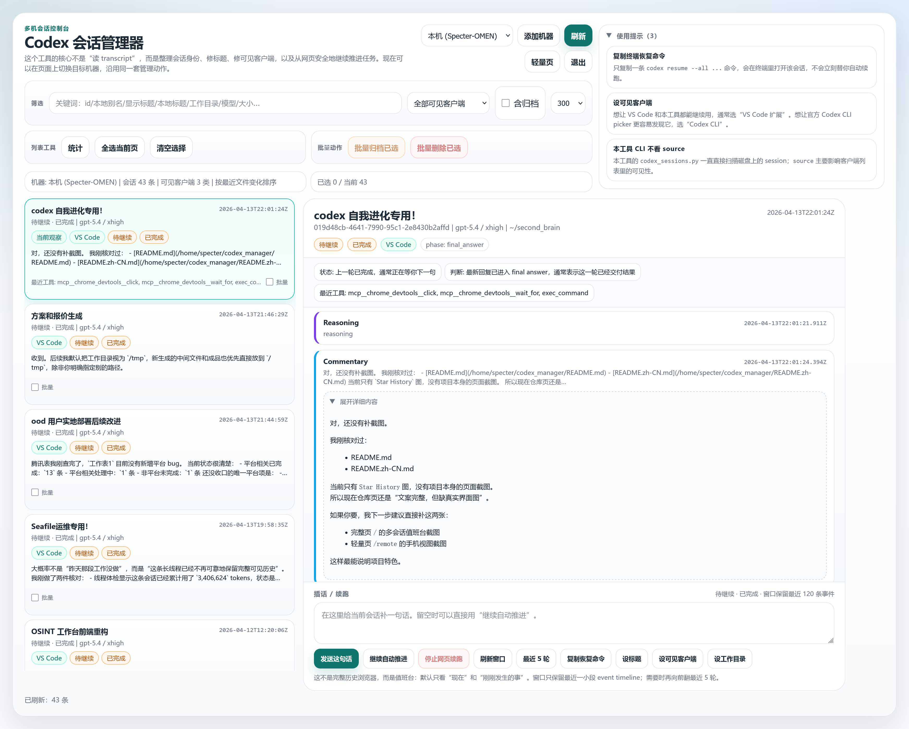
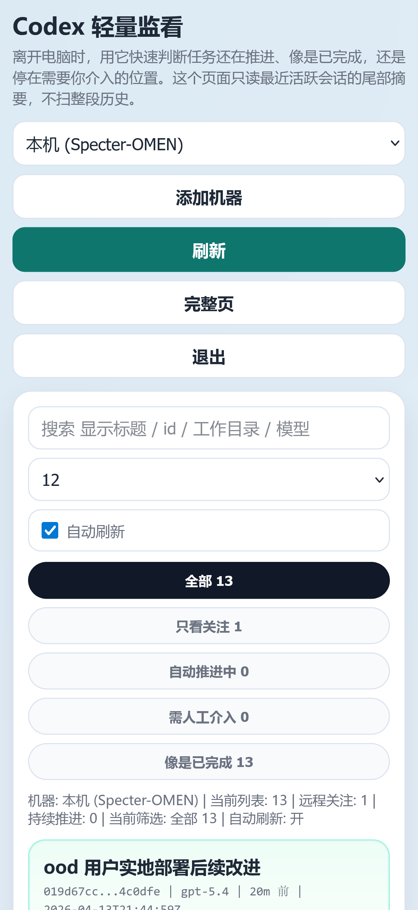
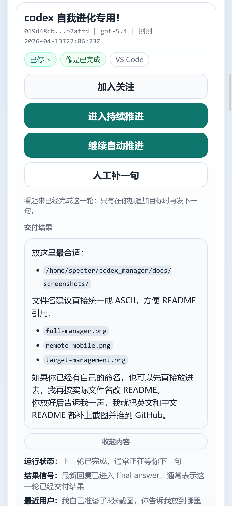

# Codex Manager

`codex_manager` is a local-first supervision console for Codex sessions.

It is designed for the situation where the hard part is no longer "can an agent do the work?", but "can I reliably watch, steer, and recover several long-running sessions without opening every client and without loading giant session files into memory?".

[中文说明 / Chinese README](./README.md)

## Screenshots

### Full manager



### Lightweight remote page

<table>
  <tr>
    <td></td>
    <td></td>
  </tr>
</table>

## What It Is Good At

- **Multi-session supervision**
  - scan many Codex sessions from one page instead of living inside one active thread
- **Bounded live observation**
  - recent event windows, commentary, tool calls, tool-output summaries, and completion markers
  - avoids loading entire giant `.jsonl` transcripts by default
- **Phone-friendly intervention**
  - `/remote` lightweight page for watching progress, nudging sessions, and stopping web-triggered resume jobs
- **Conservative "keep going" automation**
  - optional `持续推进` mode only resumes after an explicit `task_complete`
  - no idle-time guessing
  - single-instance supervisor lock prevents double-running loops
- **Small-scale multi-machine control**
  - switch between a few Codex hosts from one control plane
  - bootstrap a remote host over `ssh + sudo -n` instead of manually babysitting a second checkout
- **Safer remote operations**
  - compatibility checks before attaching to a remote host
  - service/version/API checks before bootstrap or takeover

## What It Is Not

`codex_manager` is intentionally **not** trying to replace every other Codex-adjacent tool.

- It is **not** the best choice when you mainly want one polished active-thread coding UI with diff review and worktree-centric development. The official Codex app is better for that.
- It is **not** a chat-platform bridge. If your main workflow is Feishu / Slack / Telegram / Discord as the primary control surface, a project like `cc-connect` is a better fit.
- It is **not** a mobile-first encrypted remote-control product. If your main goal is "take over one live agent from my phone anywhere", a project like `Happy` is more aligned.

This project is optimized for a different problem:

> "I already have real Codex sessions running on local or remote machines. I need a bounded, low-drama way to watch them, decide which one needs intervention, and continue them from desktop or phone."

## Where It Stands Relative To Similar Projects

| Tool | Best At | Where `codex_manager` Is Different |
| --- | --- | --- |
| [OpenAI Codex app](https://openai.com/index/introducing-the-codex-app/) | one active coding thread, diff review, isolated coding workflows, official app-server UX | `codex_manager` is stronger when you want a duty-console view over many existing sessions and a bounded tail-oriented live window |
| [Happy](https://github.com/slopus/happy) | mobile/web remote control, push notifications, device switching, encrypted remote-mode experience | `codex_manager` does not wrap your CLI usage; it watches existing session artifacts and is better at side-by-side multi-session triage |
| [cc-connect](https://github.com/chenhg5/cc-connect) | chat-platform bridge for agents across Feishu / Slack / Telegram / Discord / WeChat Work | `codex_manager` is a browser control plane, not a ChatOps bridge; the focus is observability and intervention, not IM integration |

The core differentiators here are:

- **Bounded-memory session observation**
  - the UI is built around recent event windows and tail reads, not full transcript hydration
- **Conservative supervision**
  - explicit `task_complete` handling, not "it has been quiet for a while so maybe resume"
- **Shared multi-browser control plane**
  - remote machine definitions live on the server, so desktop and phone see the same target list
- **Bootstrap instead of manual duplicate setup**
  - for supported remote machines, the UI can check, deploy, upgrade, and register the remote helper service

## Current Product Shape

`codex_manager` currently has two entrypoints.

- `codex_sessions.py`
  - CLI for listing, inspecting, renaming, archiving, deleting, and resuming sessions
- `codex_sessions_web.py`
  - web UI and JSON APIs
  - full manager at `/`
  - lightweight mobile page at `/remote`

### Full Manager: `/`

The main page is a two-pane supervision console:

- **left**: fleet list
  - scan many sessions quickly
  - see state, recent progress, attention cues, and lightweight metadata
- **right**: selected-session live console
  - recent commentary
  - tool calls
  - tool-output summaries
  - token/completion markers
  - explicit history fetch when needed

It is deliberately **not** a full transcript browser by default.

### Lightweight Page: `/remote`

The lightweight page is designed for phone and tablet use:

- watched sessions
- quick filters
- recent delivery/result preview
- one-tap continue
- one-tap stop for web-triggered resume jobs
- optional `持续推进`

`持续推进` is intentionally conservative:

- checks every 3 minutes
- only resumes after explicit `task_complete`
- records the completed turn it already resumed
- uses a supervisor lock so only one web instance performs the loop

## Remote-Host Model

The remote model is now:

- one control-plane machine serves the UI
- each target machine runs its own loopback-bound `codex_manager` web service
- the control plane proxies API actions over SSH to that target

This is intentional. It avoids re-implementing the entire session model over ad-hoc SSH parsing.

### Why Not "Raw SSH Only"?

Because once you need all of these reliably:

- session inventory
- bounded event windows
- recent history fallback
- continue/stop semantics
- conservative auto-continue
- compatibility checks

...a tiny loopback helper on the target is simpler and more predictable than teaching the control plane to parse everything remotely from scratch.

### Remote Bootstrap

If you have:

- SSH access
- `sudo -n true`
- `python3`
- `curl`
- `tar`

then you can bootstrap a remote target from the current local checkout:

```bash
python codex_sessions_bootstrap.py \
  --host remote-host \
  --user your-ssh-user \
  --label "Remote box" \
  --bind-port 8765
```

The helper will:

- package the current repository
- upload it over SSH
- install it under `~/.local/share/codex_manager`
- write/update a `systemd` unit
- start the loopback-bound service on the remote host
- verify `http://127.0.0.1:<port>/api/remote_sessions`
- optionally register the target locally

The web UI can also:

- check whether a target already has `codex_manager`
- check whether the service is running
- verify API compatibility (`sessions`, `remote_sessions`, `events`)
- compare remote release metadata against the local checkout

## Authentication And Exposure Model

The web UI supports optional password auth.

Typical deployment pattern:

- direct loopback access can bypass login
- non-loopback access requires password
- mutating requests require CSRF protection

Example local URLs:

- `http://127.0.0.1:8765/`
- `http://127.0.0.1:8765/remote`

On this machine, the service is often exposed to the LAN with:

- loopback bypass for local use
- password required for LAN / tunnel access
- LAN-only firewall rules on the Linux side
- matching WSL / Hyper-V port allow rules on Windows

## Repository Layout

- `codex_sessions.py`
  - CLI entrypoint
- `codex_sessions_web.py`
  - web UI, APIs, remote proxying, supervision logic
- `codex_sessions_bootstrap.py`
  - SSH + sudo remote bootstrap / upgrade helper
- `codex_manager_release.py`
  - release metadata and version comparison helpers
- `test_codex_sessions_web.py`
  - web/API behavior tests

## Quick Start

Run from the repository root:

```bash
uv run python codex_sessions.py --help
uv run python codex_sessions_web.py --help
```

Typical CLI usage:

```bash
uv run python codex_sessions.py list --limit 20
uv run python codex_sessions.py show <session-id>
uv run python codex_sessions.py set-alias <session-id> <alias>
uv run python codex_sessions.py set-title <session-id> "Clearer title"
uv run python codex_sessions.py set-source <session-id> vscode
uv run python codex_sessions.py set-workdir <session-id> ~/project
uv run python codex_sessions.py resume <session-id>
uv run python codex_sessions.py resume <session-id> --non-interactive --prompt "Please continue pushing toward a verifiable result."
uv run python codex_sessions.py paths
```

Start the web UI:

```bash
uv run python codex_sessions_web.py --host 127.0.0.1 --port 8765
```

Then open:

- `http://127.0.0.1:8765/`
- `http://127.0.0.1:8765/remote`

## Main Routes And APIs

Main routes:

- `GET /`
- `GET /remote`
- `GET /login`

Read APIs:

- `GET /api/sessions`
- `GET /api/history`
- `GET /api/events`
- `GET /api/remote_sessions`
- `GET /api/remote_guard`
- `GET /api/progress`
- `GET /api/targets`

Mutating APIs:

- `POST /api/continue`
- `POST /api/stop`
- `POST /api/set_title`
- `POST /api/clear_title`
- `POST /api/set_source`
- `POST /api/set_workdir`
- `POST /api/archive`
- `POST /api/delete`
- `POST /api/targets`
- `POST /api/targets/delete`

Compatibility aliases still exist:

- `POST /api/rename` -> `POST /api/set_title`
- `POST /api/unname` -> `POST /api/clear_title`
- `POST /api/set_cwd` -> `POST /api/set_workdir`

## Development

Basic checks:

```bash
python -m py_compile \
  codex_sessions.py \
  codex_sessions_web.py \
  codex_sessions_bootstrap.py \
  codex_manager_release.py \
  test_codex_sessions_web.py

python -m unittest test_codex_sessions_web.py
```

## Version Control Notes

Some deployments are plain Git repos. Some are colocated `jj + git`. Some are runtime copies without either.

Check what you actually have before assuming workflow:

```bash
git status
jj status
```

## License

Apache-2.0. See [LICENSE](./LICENSE).

## Star History

[](https://www.star-history.com/#SpecterHi/codex_manager&Date)
